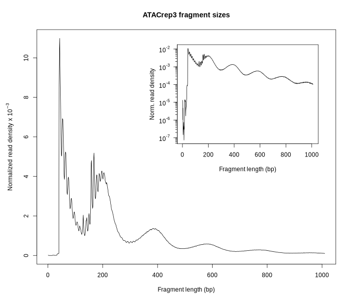
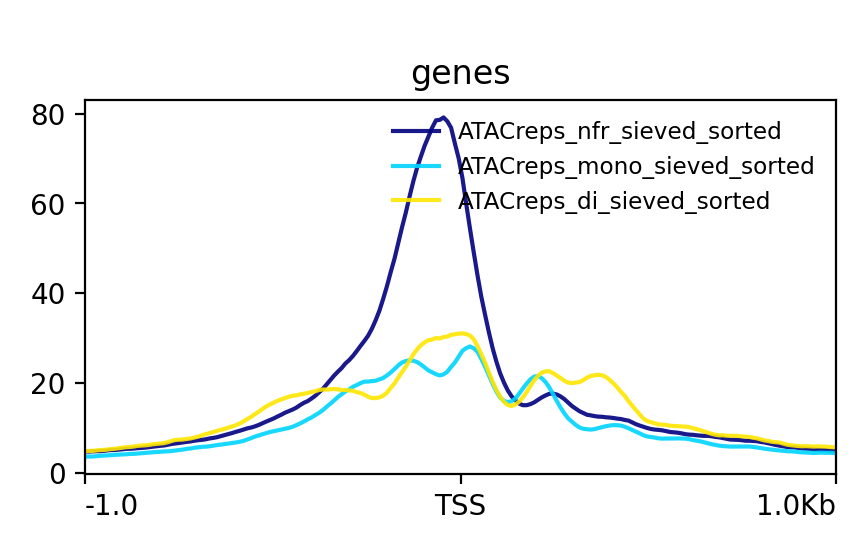
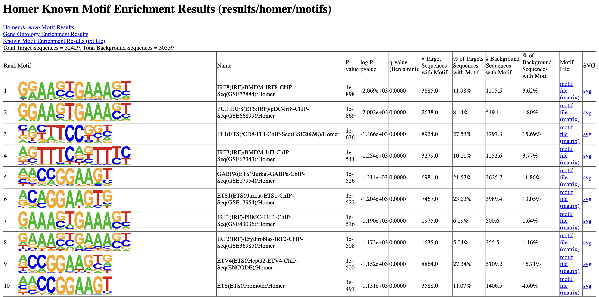
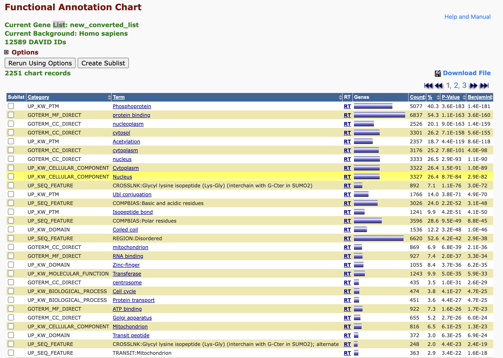

```{r setup, include=FALSE}
knitr::opts_chunk$set(echo = TRUE)
```

# BF528 Final Project

## ATACSeq Pipeline

## Introduction

## Methods

## Results/Deliverables

For the ATAC-Seq project, there were 8 deliverables.

### 1: Fragment length distribution plots

```{r out.width="80%"}


```

These plots show a distribution of fragment lengths collected from sequencing. 
There are clear bumps displaying the nucleosome free regions (<150 bp), mono-nucleosome bound regions (b/w 150-300bp), di-nucleosome bound regions (300-480bp), etc. 
High similarity is observed across both replicates as well. 
Plots were produced using a custom R script employing ATACSeqQC.


### 2. Filtering mitochondrial genome reads
**Table 1** Table showing number of reads in each replicate mapping to the Mitochondrial Genome
<style>
  table {
      width: 100%;
      border: 1px solid;
  }
  th {
			background-color: #9097fc;
			font-weight: bold;
  }
		
  tbody tr:nth-child(even) {
			background-color: #dedede;
  }
		
  tbody tr:nth-child(odd) {
			background-color: #c2c2c2;
  }
  td {
      padding: 0 15px;
      text-align: center;
  }
</style>
<table> 
  <tr>
    <th>Replicate</th>
    <th>Number of Mapped Reads</th>
    <th>Number of Mapped Reads no MT</th>
    <th>Number of MT Reads</th>
  </tr>
  <tr>
    <td>Rep3</td>
    <td>155,771,633</td>
    <td>39,439,668</td>
    <td>116,331,965</td>
  </tr>
  <tr>
    <td>Rep4</td>
    <td>114,717,279</td>
    <td>29,879,878</td>
    <td>84,837,401</td>
  </tr>
</table>
\

Part of standard ATAC-Seq protocol is to filter out reads that have mapped to the mitochondrial genome.
This is particularly important in ATAC-Seq given the principle of Tn5 Transposase preferentially binding to nucleosome-free DNA (e.g. mitochondrial DNA).
After using bowtie2 to align our paired end reads to hg38 reference genome, we use Samtools and awk to remove alignments that align to 'chrM'.
Flagstats is used to assess the number of reads present in the pre/post-filtered bams, and the results are presented in the table above.
Expectedly, a large proportion of the reads mapped to the mitochondrial genome.


### 3. Signal coverage plots for NFR and NBR
```{r out.width="80%"}

```
\
To assess the amount of signal present around gene regions' transcription start sites, Deeptools was used to generate a signal coverage plot.
Alignment bams were first split by fragment lengths to divide signal coverage into three categories: nucleosome free regions (NFR), mononucleosome bound fragments (mono), and dinucleosome bound fragments (di).
Deeptools was used to combine signal coverage from each replicate together, and then to compute a matrix comparing signal coverage for the three categories using hg38 gene regions.
The plot shows that NFRs, representing free DNA regions found near gene promoters, have much higher signal compare to mono-/di-nucleosome bound DNA fragments. 
This information could be used in conjunction with other types of sequencing experiments to analyze patterns of gene expression and gene regulation.


### 4 & 5. Number of reproducible peaks
\
**Table 2** Table of peak counts
<table id='peaks_table' style='width:50%;'> 
  <tr>
    <th>Replicate</th>
    <th>Number of Peaks</th>
  </tr>
  <tr>
    <td>Replicate 3</td>
    <td>43,466</td>
  </tr>
  <tr>
    <td>Replicate 4</td>
    <td>35,709</td>
  </tr>
  <tr>
    <td>Replicate 3x4</td>
    <td>32,419</td>
  </tr>
</table>
\

Peak calling was performed using MACS3 on each replicate, and then bedtools intersect was used to produce a list of reproducible peaks (Replicate 3x4).
Additionally, Replicate 3x4 was filtered to exclude known blacklisted regions.
Ultimately, there were roughly ~32K reproducible peaks, and this bed file can be found in `results/bedtools/ATACpeaks_noBlacklist.bed`.

### 6. Motif analysis on reproducible peaks
\
```{r out.width="100%"}

```
\

Homer's `findMotifsGenome.pl` identifies motifs found in the reproducible peak's sequences and reports them in the table shown above.
In our reproducible peaks, we see an enrichment of Interferon regulatory factor (IRF) family of genes and transcription factors.


### 7. Gene Enrichment Analysis

``` {r out.width="100%"}

```

We manually extracted a list of unique gene names using awk and the annotated peaks file.
This list was uploaded and submitted to the DAVID Functional Annotation website to identify cellular functions that have been enriched in the sample.
It is hard to discern any clear patterns of enrichment through DAVID.
Many of these functions are involved in cellular maintenence and growth.


### 8. Proportion of accessible chromatin regions 


